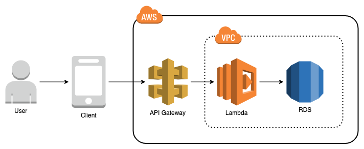

# Diet Journal: Server

REST API server and infrastructure that stores and modifies data needed for a client side application that records students diet habits.

## Goals

* Create a REST API that stores and modifies the data for the client application in a PostgreSQL database.
* Zero downtime of server upgrades by managing database migrations at server startup rather than manually.
* Describe and deploy the infrastructure in AWS using terraform.

## Steps

Most of our development is driven by what the other team wants in terms of functionality, so our bottleneck is them creating that information to send to us. In the meantime, we can create a framework that allows us to quickly setup what endpoints they might need.

Our group will be split into two groups: the server development group and infrastructure management group. The server development group will be responsible for all the server logic and all the endpoint creation. The infrastructure management group will be responsible for managing the AWS infrastructure.

### Server Development

The first thing the server team has to decide on is which server framework they want to use: Flask or Django. Flask is very easy to get up and running, but the complexity lies in tying together different libraries and middleware. Django comes with everything included, like a built in object relational mapper and database migration tools, but there's more ramp up time in learning the framework.

* Django: https://docs.djangoproject.com/en/2.2/
* Flask: https://flask.palletsprojects.com/en/1.1.x/

In order to get rest features with django then you'll need to include:

* Django REST framework: Framework for mapping database objects to API endpoints https://www.django-rest-framework.org

In order to get Flask up to the same level of Django, you typically have to include:

* Flask-SQLAlchemy: Integrates Flask with the object relational mapper SQLAlchemy https://flask-sqlalchemy.palletsprojects.com/en/2.x/
* Flask-Migrate: Integrates flask with Alembic, the SQLAlchemy migration manager https://flask-migrate.readthedocs.io/en/latest/
* Flask-RESTFul: Allows for creation of REST API endpoints https://flask-restful.readthedocs.io/en/latest/

The server development group will initially create a Hello World server that should serve at the root endpoint `GET https://website.com/` a JSON object with the message "Hello World":

```json
{
  "message": "Hello World"
}
```

After this is working, then they'll move onto integrating this into a database that stores all the messages in a database and returns the current list of messages. This will involve a few different endpoints:

#### `GET /`

The original hello world message:

```json
{
  "message": "Hello World"
}
```

#### `GET /messages/`

Returns the list of current messages. It should return a list that looks like:

```json
{
  "count": 3,
  "results": [
    {
      "id": 1,
      "message": "What is love? Baby don't hurt me."
    },
    {
      "id": 2,
      "message": "Baby shark do do do do do do baby shark."
    },
    {
      "id": 3,
      "message": "ITS LIKE RAEEAAAAAAIN ON YOUR WEDDING DAY"
    }
  ]
}
```

#### `GET /messages/:id/`

Returns a message by it's ID. So if a user reached `GET /messages/1/`:

```json
{
  "id": 1,
  "message": "What is love? Baby don't hurt me."
}
```

#### `POST /messages/`

Create a new message. If the payload sent to the endpoint is:

```json
{
  "message": "You used to call me on your cell phone"
}
```

Then it should return:

```json
{
  "id": 4,
  "message": "You used to call me on your cell phone"
}
```

Which should show up in the next list:

```json
{
  "count": 4,
  "results": [
    {
      "id": 1,
      "message": "What is love? Baby don't hurt me."
    },
    {
      "id": 2,
      "message": "Baby shark do do do do do do baby shark."
    },
    {
      "id": 3,
      "message": "ITS LIKE RAEEAAAAAAIN ON YOUR WEDDING DAY"
    },
    {
      "id": 4,
      "message": "You used to call me on your cell phone"
    }
  ]
}
```

And should return based off it's new ID at `GET /messages/4/`:

```json
{
  "id": 4,
  "message": "You used to call me on your cell phone"
}
```

More information about this REST architecture is below in the REST API section.

### Infrastructure Management

AWS will be managed using terraform. This is a tool that allows individuals to represent their architecture as code so they can deploy simply by running `terraform apply`. Typically this is done by manually setting up the instances through the AWS console or by using the AWS CLI. This leads to issues where someone made a change that wasn't documented which ends up breaking certain services. By using terraform, we can track how our infrastructure changes the same way we use GIT to track how our code changes.

More information on the infrastructure is in the infrastructure section and more info on terraform is in the terraform section.

## Infrastructure



This is an overview of the general infrastructure of the project in AWS and how the client application interacts with it. Our group is responsible for the pieces within AWS.

* **API Gateway**: Routes requests to the server. This service is managed by AWS without us having to worry about scaling anything up or down. We just get billed based on traffic. There is also a lot of other functionality, like authentication, we can use when we get to those cross roads. https://aws.amazon.com/api-gateway/
* **VPC**: Stands for virtual private cloud. This is akin to a private network that contains many servers that can communicate to each other locally. Anything that enters or leaves this network is controlled based on firewall rules. https://aws.amazon.com/vpc/
* **Lambda**: Instanced computing that runs only when called. This is where the server code will be run. This is different from a normal server environment where you start the server and it listens on a port for traffic until you stop the server. This starts up an instanced server that runs it's assigned function then stops. This is a huge cost saving over using a regular server instance (EC2) because we only pay for the times the server runs. https://aws.amazon.com/lambda/
* **RDS**: Stands for Relational Database Service. This is a managed database service that we can use to host our PostgreSQL database. It abstracts away the complexity of managing and scaling the hardware so we can focus on managing the data. https://aws.amazon.com/rds/

## Development

### Git Workflow

We'll be using the feature branch workflow for this project, which is outlined here: https://www.atlassian.com/git/tutorials/comparing-workflows/feature-branch-workflow

Essentially what this means is that when we need to add a new feature, you should create a new git branch with that feature name like `user-endpoint`. Then once that feature is complete, you create a pull request that asks for that branch to be merged into master. We can then review that change and merge in the new feature. It looks like this:


This allows us to make sure we're not blindly pushing to the master branch and wondering why something broke.

### Terms

These are terms that people will need to know in order to create the product.

#### REST API

Stands for Representational State Transfer (REST) Application Programming Interface (API). The formal definition of REST from wikipedia is "Web services that conform to the REST architectural style, called RESTful Web services (RWS), provide interoperability between computer systems on the Internet. RESTful Web services allow the requesting systems to access and manipulate textual representations of Web resources by using a uniform and predefined set of stateless operations."

In regular terms, this means that you have URL endpoints that represent particular data objects that you interact with using HTTP commands like `GET`, `POST`, `PUT`, `PATCH`, `DELETE` etc. The people at smashing magazine can explain this much better than I can:

https://www.smashingmagazine.com/2018/01/understanding-using-rest-api/

In any case I'll show an example for modifying user objects.

##### GET User List

Users must live under a particular uniform resource identifier in order to be retrieved. This can be represented by the URL `https://website.com/users/`. When performing a `GET` request to that URI it responds with a response that might look like:

```json
{
  "count": 3,
  "results": [
    {
      "id": 1,
      "first_name": "Chuck",
      "last_name": "Norris"
    },
    {
      "id": 2,
      "first_name": "Chuck",
      "last_name": "Testa"
    },
    {
      "id": 3,
      "first_name": "Billy",
      "last_name": "Bob"
    }
  ]
}
```

This returns a count of the current users and the list containing all the current user information as JSON.

If the user needs to filter the users returned, it can add query parameters in the URI to filter by things like `first_name`: `https://website.com/users/?first_name=Chuck`. This would return:

```json
{
  "count": 2,
  "results": [
    {
      "id": 1,
      "first_name": "Chuck",
      "last_name": "Norris"
    },
    {
      "id": 2,
      "first_name": "Chuck",
      "last_name": "Testa"
    }
  ]
}
```

You'll notice that the list was filtered down to the two people who had Chuck as a first name.

##### GET User

In order to get a particular user, it must be retrieved by sending a GET request to a unique URI. Since the user list is located at `/users/` then we can get the user with ID `1` by sending a `GET` request to: `https://website.com/users/1/`. This will respond with the user object.

```json
{
  "id": 1,
  "first_name": "Chuck",
  "last_name": "Norris"
}
```

You should notice that this is the same as the user in the user list.

##### PUT User

To modify that user, you can perform a `PUT` request at the previous URI `https://website.com/users/1/` with a payload matching the user data shape. If we wanted to change the last name to `Forest` we would send the payload.

```json
{
  "id": 1,
  "first_name": "Chuck",
  "last_name": "Forest"
}
```

The API should respond with an `HTTP 200 OK` with the mirrored payload:

```json
{
  "id": 1,
  "first_name": "Chuck",
  "last_name": "Forest"
}
```

If the endpoint received the wrong data shape for the payload, such as if `first_name` was just `name`, it should return with an `HTTP 400 BAD REQUEST` with an error message:

```json
{
  "fields": {
    "first_name": ["Field is required"]
  }
}
```

This is to prevent any malformed data from entering the system.

##### PATCH User

What if you just want to update a single field of the model without having the replace the whole data shape? If you replace `PUT` with `PATCH` then it should accept a subset of the data shape you wish to update. Instead of the entire data to replace, you can send a payload with just:

```json
{
  "last_name": "Man"
}
```

And it should return the updated data shape with an `HTTP 200 OK`:

```json
{
  "id": 1,
  "first_name": "Chuck",
  "last_name": "Man"
}
```

##### DELETE User

In order to delete the user, we just have to send a `DELETE` request to the users URI: `https://website.com/users/1/`. This should respond with `HTTP 200 OK` with an optional payload containing the user that was just deleted:

```json
{
  "id": 1,
  "first_name": "Chuck",
  "last_name": "Forest"
}
```

If we tried to `DELETE` from that URI again, we should get an `HTTP 404 NOT FOUND` error because there is no user that exists at that URI anymore.

##### POST User

Lets say that we have a new user that we need to create but doesn't have an identifier yet. Then we perform a POST request at the original user list. This is an important 

##### Summary

Based on my small example, you can see how much a REST API hinges on the base HTTP commands to represent state transfers. It can be tricky to figure out what to call endpoints and what data to return from those endpoints, but after viewing a couple of examples on the web you'll notice they all follow a similar pattern:

* List of items are typically placed under their plural name: `GET /users/`.
* Individual items are retrieved using their ID after their plural name: `GET /users/1/`.
* Deleting and modification of a single item is done at the items unique URI: `PUT /users/1/`, `DELETE /users/1/`, `PATCH /users/1/`.
* Creation of items that don't have a known identifier are posted to the item list: `POST /users/`.
* `GET` returns the same data shape every time and typically doesn't expect any payload. Any filters to the retrieved data are used in the URL query parameters `?first_name=Chuck&last_name=Norris`.
* `PUT` expects the same data shape as the data it's replacing.
* `PATCH` will accept a subset of the data shape it's updating.
* `DELETE` will delete INDIVIDUAL items at unique URIs without requiring a payload. This means you can't just `DELETE /users/` because that would cause a crisis.
* If an item has another item it's associated with, or a nested item, you can reach it at a subdirectory under the items unique URI. If a user had a configuration associated with it, then it could be retrieved at `GET /users/1/config/`. Be wary with creating a deeply nested relationship like this though because it can get hard to manage.

### Tools

These are the collection of tools we've chosen to use to manage and create the project.

#### Python

General programming language that we will use for creating the server software. It's design focus on simplicity allows us to get from implementation to delivery very quickly. The ecosystem of third party libraries and large standard library also allows us to prevent reinventing the wheel for common use cases.

##### Learning Resources

These are some great resources for learning the general syntax directly from the python documentation:

* General language syntax: https://docs.python.org/3/tutorial/introduction.html
* Control flow: https://docs.python.org/3/tutorial/controlflow.html
* Data structures - List, Dictionary, Set: https://docs.python.org/3/tutorial/datastructures.html
* Modules: https://docs.python.org/3/tutorial/modules.html
* Classes: https://docs.python.org/3/tutorial/classes.html

If you come from knowing a different language then it might be easier to search for `python for [language] developers`.

##### Dependency Management

Python comes bundled with it's own dependency management tool called `pip`. In order to add a third party library that lives on the [Python Package Index (PyPI)](https://pypi.org) you only have to run the command `pip install [dependency]`. This will place the latest version of the package into your current python environment.

When you install this dependency, it does not make a record of it anywhere. This is a different workflow compared to using other dependency managers in other languages that either record them automatically or require them to be recorded in a file before installation.

There are a few  different ways to record dependencies so that they can be reinstalled on another system. The most commonly documented way is by dumping the current dependency tree in the environment by running the command `pip freeze > requirements.txt`. This freezes the exact dependency list in a text file that will look something like this:

```text
Django==2.2.4
cryptography==2.6.1
```

In order to reinstall these packages on a different machine, you only have to run `pip install -r requirements.txt`. This looks for the versions of each package specified in the file and installs those dependencies onto that machine. This is great for creating an exact reproducible environment every time.

##### setuptools

Even though most learning resources recommend freezing into a requirements file, we'll be using setuptools to install packages instead. You'll notice a file in this repo called `setup.py`. This is a file that contains information on how to package a project for deployment. For our initial uses, we'll just be using it to define required dependencies.

You should notice a line in the file called `install_requires`. This is an array of dependencies need from pip to package the product. This can reflect the previous requirements file if needed:

```python
from setuptools import setup, find_packages

setup(
    name='diet-journal-api',
    version='0.1.0',
    packages=find_packages(),
    python_requires='>=3.6',
    install_requires=[
        'Django==2.2.4',
        'cryptography==2.6.1',
    ],
)
```

This is not the recommended way to define dependencies when using setuptools, and is where dependency definition between `requirements.txt` and `setup.py` differs. When defining dependencies in `setup.py` you can specify a range of versions to cover. Most of these are covered here: https://pip.readthedocs.io/en/stable/reference/pip_install/#requirements-file-format

For our use case, it's best to just use the compatible release version:

```python
from setuptools import setup, find_packages

setup(
    name='diet-journal-api',
    version='0.1.0',
    packages=find_packages(),
    python_requires='>=3.6',
    install_requires=[
        'Django~=2.2.4', # Django versions >= 2.2.4 but < 2.3
        'cryptography~=2.6.1', # cryptography version >= 2.6 but < 2.7
    ],
)
```

This ensures that each package gets any bug fixes but doesn't introduce any new features that might break the application.

In order to install this on our machine, we just run `pip install -e .`. This will install just the dependencies and symlink the repo to the dependencies.

##### Virtual Environments

Right now when you `pip install` any dependencies, they're being installed globally on your system. In order to prevent that, you need to create a virtual environment on your local machine so you can have versioned dependencies for a particular project. Otherwise you'll have multiple projects sharing the same dependencies. When one project updates the dependency to a new version it breaks the other project that requires a previous version.

Here's some documentation on the process: https://packaging.python.org/guides/installing-using-pip-and-virtual-environments/

Luckily python has made this super easy now. In order to create a virtual environment, you simply call `python -m venv venv` at the root of the project. This runs the `venv` command and creates a folder named `venv` that contains your new environment.

When developing for that new environment, you first have to activate it:

* Mac/linux: `source venv/bin/activate`
* Windows: `.\venv\Scripts\activate`

Now any dependencies you install in this environment by doing `pip install -e .` will be local to this project. Anything you run in that terminal window will also be using those versioned dependencies.

KEEP IN MIND that once you leave or close that terminal window you will no longer be in that virtual environment. You'll have to reactivate it again.

##### Caveats

The language itself was created in the early 90's around the time linux was created. Because of this, the language itself works very well with linux and is interoperable with C code. You'll often find that some third party libraries, like the PostgreSQL driver `psycopg2`, requires specific C modules in the underlying OS to run. These dependencies are the ones that will cause you the most problems, especially on windows machines.

#### Terraform

Terraform is a tool that helps manage infrastructure by describing and deploying servers and resources through code rather than manually setting up the infrastructure. This is extremely helpful because instead of trying to track down undocumented changes that broke the infrastructure we can track it through the repository.

Right now all I can provide on this is the link to the documentation, because this is something that I'm also learning: https://www.terraform.io

### Directory Structure

Use this section as is a general overview of the directory structure to decide where to place code. This will be a living document as the directory structure grows.

* `docs`: Documentation information.
* `infrastructure`: Terraform code that reflects the AWS infrastructure.
* `server`: Python code used to make the server.
* `README.md`: This documentation file.
* `setup.py`: Python packaging logic.

### CI Pipeline

Once we start to get the initial infrastructure and server development, we'll set up a CI pipeline that can handle our common tasks like running tests and packaging code for deployment to AWS.

This can either be done through Github Actions, which is still in beta, or Travis. Travis has been around for a while and is very robust but Actions is supposed to be better integrated into Github. We'll cross this bridge when we get to it.

